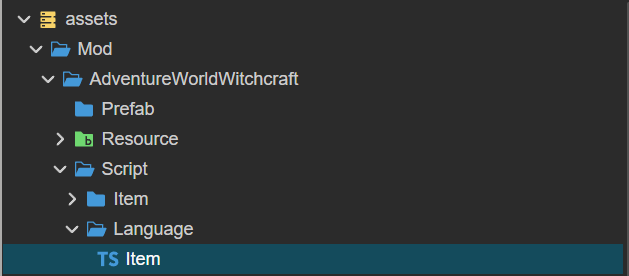

# Slaughter 源码文档

首先非常感谢您对我作品的支持，如果您有什么好的建议或者发现任何漏洞错误，可以通过微信：**xiaojiangbuhuia** 并备注 "Cocos Slaughter 意见反馈"来添加作者本人进行反馈咨询，我也会尽全力去完善该作品并完善对源码的讲解。创作不易，再次感谢您对我作品的支持。

## 目录详解

```
|-- assets /** 所有脚本，精灵图，预制体资源文件夹 */
	|-- Module /** 通用工具模块 */
        |-- Axios /** 网络请求模块 */
        |-- CcNative /** 对Cocos模块常用功能的封装 */
            |-- Asset /** 对加载和资源管理功能的封装 */
            |-- Storage /** 对本地存储功能的封装 */
        |-- EventManager /** 事件管理器 */
        |-- Extension /** 对Cocos功能的简单扩展 */
            |-- Component /** 扩展的组件 */
        |-- Language /** 多语言功能 */
        |-- Rx /** 移植自 Vue3 的响应式模块 */
	|-- Mod /** 自定义游戏功能，包含所有怪物，物品，装备，成就，技能，关卡等信息 */
		|-- Base /** 基本内置的关卡，怪物，技能等 */
	|-- Prefab /** 预制体脚本与数据 */
		|-- Prefab /** 预制体数据 */
		|-- Script /** 预制体脚本 */
	|-- Resource /** 内置的音频，图片资源模块 */
	|-- Scenes /** 场景数据 */
	|-- Script /** 游戏脚本，负责系统和界面还有引擎的交互以及协作 */
		|-- Component /** Cocos组件分为通用和场景特有组件，分别在两个文件夹中 */
			|-- Extension /** 扩展通用组件 */
			|-- Scenes /** 场景特定组件 */
		|-- Data /** 用户数据存储与操作，还负责监听任务和成就的完成情况 */
		|-- Game /** 游戏内置的基本物品信息 金币，钻石 */
		|-- Language /** 多语言实现 */
		|-- Share /** 通用代码实现，例如：场景跳转，消息提示，战斗数据管理等等 */
	|-- System /** 游戏系统设计 */
		|-- Game /** 游戏系统设计 */
			|-- Fight /** 游戏战斗流程模块 */
			|-- Instance /** 物品，buff，角色等原型的实例 */
			|-- Property /** 各种属性设计 */
			|-- Prototype /** 物品，buff，角色等原型类 */
		|-- Util /** 游戏通用工具 */
	
```

以上就是整个目录和模块的基本描述了。接下来我们看看比较核心的部分，战斗流程的解析。

## 战斗流程详解

战斗流程作为游戏的核心玩法，涵盖了包括 **技能** **装备** **buff**  等各方面的影响，导致其本身具有一定的复杂性，这里会对整个战斗流程进行详细的讲解，如有缺漏疑问，望告知。

### 战斗玩法

该游戏使用的是半回合制战斗的玩法模式，玩家控制的角色会同时面对一个或多个敌人，每个角色均有各自的攻击速度，攻击力，生命值......等基础属性，并且每个角色都会根据自己的攻击速度来进行不同频率的攻击，直到一方完全丧失所有的角色与角色生命值为止。

游戏中的基础属性有：

生命值，魔法值，攻击力，暴击率，魔力值，防御力，魔抗，穿透力，暴击伤害，攻击速度

以下为战斗场景的截图展示：


归根结底，无非就是我攻击一下你，你攻击一下我来回循环的玩法，所以我们接下来主要讲解一下攻击逻辑的实现。

### 攻击流程

游戏中攻击是游戏进行的主要逻辑之一，攻击造成伤害会受到多个因素的影响，例如装备，buff等等，他们除了提供基础属性外，有些还会提供额外的功能，例如 **重伤**，**流血** 等等。所以在游戏中作者提供了一系列接口可以用来自定义或者控制产生的效果。下图展示了攻击产生的全流程:


当攻击开始之前，游戏中会创建一个 **AttackProgress** 对象，该类定义位于：**assets\System\Game\Fight\Progress\AttackProgress.ts** 文件中，定义代码简化后释意如下：

```typescript
import { Character, DamageType } from "../../Instance/Character";

/** 
AttackProgress 会在攻击造成之前被创建
并且会被作为流程控制器在装备和Buff的 beforeAttack，beforeBeAttack，afterAttack，afterBeAttack 的生命周期中被作为第一个参数传入
**/
export class AttackProgress {

    // 基础伤害，自动赋值最好不要手动修改，它代表最初始的应该造成的伤害
    public baseDamage: number;

    // 最终伤害值，最后的伤害判定采用此数值
    public finalDamage: number;

    // 伤害来源于哪一个角色
    public from: Character;

    // 要被造成伤害的目标
    public target: Character = null;

    // 是否产生了暴击
    public isCrit: boolean = false;

    // 是否可以攻击，如果被修改为false则攻击会被失效处理
    public canAttack: boolean = true;
    
    // 伤害类型
    // DamageType.PHYSICAL 物理伤害
    public damageType: DamageType = DamageType.PHYSICAL

}
```

在装备和Buff的 **beforeAttack，beforeBeAttack，afterAttack，afterBeAttack** 生命周期中，他们的第一个参数都是同一个 **AttackProgress** 实例对象。其实以上流程也适用于大多数的战斗功能实现，例如 回血，受伤，复活...... 在后续带领自实现Mod的教程中会详细讲解。

*注意：对于多个上述生命周期，不同的装备或Buff的同一个生命周期，他们的执行顺序是不被保证的，所以，不要试图了解上一个流程中对 AttackProgress 做了哪些修改。

## 自定义Mod

游戏内置了一个 Base 模块，提供了基础的几个关卡，怪物，装备，物品，Buff.......用作参考，但是要了解游戏的整体运行逻辑，我们还是需要手动实现一个Mod，并借此来详细讲解各处的详细运行逻辑。

### 文件夹创建

该部分我们来创建一个新的MOD，就叫“蛊界冒险”吧。第一步就是创建一个文件夹，在 **assets/Mod** 下创建文件夹，并且命名为 "AdventureWorldWitchcraft"，创建后的目录情况应该为：


我们将在这个目录中，添加我们自己的关卡副本，角色和对应的技能。在这个文件夹下，我们再次添加三个文件夹，可以仿造Base文件夹，分别添加 Prefab，Resource，Script 三个文件夹。并且，我们需要将Resource文件夹设置成Cocos资源文件夹并命名为 AdventureWorldWitchcraftResource ，如下图：


我们勾上 is Bundle 选项，之后命名为 AdventureWorldWitchcraftResource 如图：


这样我们就创建了一个自定义资源文件夹，可以通过 **/assets/Module/CcNative/Asset/AssetManager** 中的 CcAssetManager 类来加载对应的资源数据，具体详情可以查看该类的详解，这里做一个示例。

```typescript
import { CcAssetManager } from "db://assets/Module/CcNative/Asset/AssetManager";

const manager = new CcAssetManager("AdventureWorldWitchcraftResource")

manager.load("资源路径" , Sprite /* 资源类型 */).then(pkg => 
	console.log(pkg.value) // 这里是对应的资源数据
) 
```

至此，我们的自定义MOD文件夹就创建完成了。

### 自定义第一个物品

物品在游戏中有两个展示用的预制体分别为图标和详情，图标预制体位于 **assets\Prefab\Prefab\Common\CommonItemItemPrefab.prefab** 用于物品图标的展示，

详情位于 **assets\Prefab\Prefab\Common\CommonItemDetailPrefab.prefab** 用于物品详情的展示。

物品的基本原型类定义于 **assets\System\Game\Prototype\ItemPrototype.ts** 它的大致定义如下

```typescript


export class ItemPrototype {
    
    // 静态函数，是否存在某个id的物品
    public static hasPrototype(id: string): boolean;

    // 静态函数获取所有物品原型对象
    public static getAllPrototype(): Constructor<ItemPrototype>[];

    // 静态函数，根据id获取物品原型
    public static getPrototype(id: string): Constructor<ItemPrototype>;

    // 根据物品原型示例或者子类获取对应id
    public static getPrototypeId(target: ItemPrototype|Constructor<ItemPrototype>): string;

    constructor(public readonly item: Item);

    public get name(): string {
        return "Item 名称"
    }

    public get description(): string {
        return "Item 描述"
    }

    public get icon(): string {
        return "物品图标路径"
    }
	
    // 是否为可以使用的物品
    public get canUse(): boolean {
        return false
    }

    // 物品对应的资源管理器
    public get resourceManager(): CcAssetManager {
        return new CcAssetManager("ResourceMod")
    }

    // 使用函数，返回值为是否使用成功
    public use(count: number): boolean {
        return true
    }

}
```

我们可以通过构建物品原型类的子类来创建新的物品并将它添加到游戏中，比如我们现在需要创建一个没有任何作用的“元石”物品，如下图:


我们准备了一个这样的图标，接下来，我们需要将它添加到游戏中，来到我们刚刚创建的文件夹 **assets/Mod/AdventureWorldWitchcraft/Script** 中创建一个文件夹，命名为 Item，并创建一个文件命名为 YuanShi.ts  。

再来到 **assets/Mod/AdventureWorldWitchcraft/Resource** 中，创建一个名称为 Texture 的文件夹，并创建一个名称为 Item 的子文件夹，并将上图Icon放入该文件夹内，完整目录如下:


我们现在打开 YuanShi.ts 文件，代码大致内容如下:

```typescript
import { _decorator, Component, Node } from 'cc';
import { CcAssetManager } from 'db://assets/Module/CcNative/Asset/AssetManager';
import { UserLanguage } from 'db://assets/Script/Data/UserLanguage';
import { ItemPrototype, RegisterItemPrototype } from 'db://assets/System/Game/Prototype/ItemPrototype';
const { ccclass, property } = _decorator;

// 注册到物品原型列表中
@RegisterItemPrototype("YuanShi")
// 元石类继承自物品原型类
export class YuanShi extends ItemPrototype {

    public get canUse(): boolean {
        return true
    }

    // 物品名称，这里使用了多语言
    public get name(): string {
        return UserLanguage.getInstance().getEntry("原石").value
    }

    public get resourceManager(): CcAssetManager {
        return new CcAssetManager("AdventureWorldWitchcraftResource")
    }
    
	// 图标路径
    public get icon(): string {
        return "Texture/Item/yuanshi/spriteFrame"
    }

    public get description(): string {
        return UserLanguage.getInstance().getEntry("原石简介").value
    }

    public use(count: number): boolean {
        return true
    }
}
```

之后我们打开游戏浏览器预览，通过控制台输入命令来获取对应的物品 `slaughterGameCommonedAddItem("YuanShi" , 20)` 这里我们添加了20块刚刚添加的元石，来到背包界面就可以看到了。

### 添加多语言翻译

我们打开控制台时，应该可以看到这样的警告信息，如下图: 


这是因为我们还没有添加对应的语言翻译信息，所以导致的警告信息，此时就算我们切换语言也是无法看到实际效果的，我们只需要来给“原石”添加一个多语言翻译就可以了。我们在Script目录下添加 Language 文件夹，并添加一个名为 Item.ts 的文件。



打开该文件，我们插入以下代码

```typescript
import { RegisterLanguageEntry } from "db://assets/Module/Language/Language";
import { LanguageEntry } from "db://assets/Module/Language/LanguageEntry";

(function () {
    // 注册到翻译列表
    @RegisterLanguageEntry("原石")
    // 继承自语言实体类
    class Name extends LanguageEntry {

        protected get ZH(): string { return "原石" } // 中文

        protected get HK(): string { return "原石" } // 粤语

        protected get EN(): string { return "Stone" } // 英语

        protected get FR(): string { return "Pierre" } // 法语

        protected get JP(): string { return "石" } // 日语

        protected get KOR(): string { return "돌" } // 韩语

    }
    
    @RegisterLanguageEntry("原石简介")
    class Description extends LanguageEntry {

        protected get ZH(): string { return "一块特殊的石头" }

        protected get HK(): string { return "一塊特殊的石頭" }

        protected get EN(): string { return "A special stone" }

        protected get FR(): string { return "Une pierre spéciale" }

        protected get JP(): string { return "特別な石" }

        protected get KOR(): string { return "특별한 돌" }

    }
})();
```

至此我们就实现类对该物品的多语言转换支持，可以更换语言进行尝试。后续我们会尝试用它去强化特殊的装备。

### 自定义第一个装备

装备原型基本类定义于 **assets\System\Game\Prototype\EquipmentPrototype.ts** 其定义大约如下：

```typescript
// 继承自成长属性类
// 实现了战斗流程类，可以参与战斗流程
export class EquipmentPrototype extends GrowProperty implements FightProgress {
    
    // 根据id查询是否存在对应原型
    public static hasPrototype(id: string): boolean {
    }
	
    // 根据id或原型示例获取原型类
    public static getPrototype(id: string|EquipmentPrototype): Constructor<EquipmentPrototype> {
    }
	
    // 根据原型类或原型示例获取装备id
    public static getPrototypeId(target: EquipmentPrototype|Constructor<EquipmentPrototype>): string {
    }

    // 获取所有原型类列表
    public static getAllPrototype(): Constructor<EquipmentPrototype>[] {
        return Array.from(RegisterPrototypeMap.values())
    }

    public get name(): string {
        return "装备名称"
    }

    public get glossary(): string {
        return "套装词条"
    }

    public get description(): string {
        return "装备描述"
    }

    public get icon(): string {
        return "装备图标路径"
    }

    public get resourceManager(): CcAssetManager {
        return new CcAssetManager("ResourceMod")
    }

    public get type(): EquipmentType {
        // 装备品质
        return EquipmentType.BROKEN
    }

    // 强化所需材料
    public get strengthenMaterial(): StrengthenMaterial {
        return {}
    }

    // 分解所需材料
    public get decomposeMaterial(): DecomposeMaterial {
        return {}
    }
	
    // 获取当前装备词条数量
    protected getGlossary(): number {
    }
    
}
```

现在我们要添加一个自定义的武器，所需素材如下：


我们将它添加到文件夹 **assets/Mod/AdventureWorldWitchcraft/Resource/Equipment** 中，并命名为 DeathScythe

接下来，我们需要将它添加到游戏中，来到我们刚刚创建的文件夹 **assets/Mod/AdventureWorldWitchcraft/Script** 中创建一个文件夹，命名为 Equipment，并创建一个文件命名为 DeathScythe.ts  

文件内容如下

```typescript
import { CcAssetManager } from "db://assets/Module/CcNative/Asset/AssetManager";
import { UserLanguage } from "db://assets/Script/Data/UserLanguage";
import { EquipmentPrototype, EquipmentType, RegisterEquipmentPrototype } from "db://assets/System/Game/Prototype/EquipmentPrototype";


@RegisterEquipmentPrototype("DeathScythe")
export class DeathScythe extends EquipmentPrototype implements FightProgress {

    // 装备类型
    public get type(): EquipmentType {
        return EquipmentType.WEAPON // 武器
    }

    // 装备名称
    public get name(): string {
        return UserLanguage.getInstance().getEntry("死神镰刀").value
    }
    
    // 装备套装词条
    public get glossary(): string {
        return "死神"
    }

    // 装备使用的资源管理器
    public get resourceManager(): CcAssetManager {
        return new CcAssetManager("AdventureWorldWitchcraftResource")
    }

    // 装备图标所在路径
    public get icon(): string {
        return "Texture/Equipment/DeathScythe/spriteFrame"
    }

    // 装备描述
    public get description(): string {
        return UserLanguage.getInstance().getEntry("死神镰刀描述").value
    }

}

```

之后我们可以通过控制台命令 **slaughterGameCommonedAddEquipment("DeathScythe")** 来获取到对应的装备。此时的装备仍然没有进行多语言处理，我们添加一个 Equipment.ts 文件到 Script/Language 目录下，并写下如下内容：

```typescript
import { RegisterLanguageEntry } from "db://assets/Module/Language/Language";
import { LanguageEntry } from "db://assets/Module/Language/LanguageEntry";

(function () {
    @RegisterLanguageEntry("死神镰刀")
    class Name extends LanguageEntry {

        protected get ZH(): string { return "死神镰刀" }

        protected get HK(): string { return "死神鐮刀" }

        protected get EN(): string { return "Death Scythe" }

        protected get FR(): string { return "Fouet de la Mort" }

        protected get JP(): string { return "死神の鎌" }

        protected get KOR(): string { return "죽음의 낫" }

    }
    
    @RegisterLanguageEntry("死神镰刀描述")
    class Description extends LanguageEntry {

        protected get ZH(): string { return "攻击有概率回复部分生命值和法力值" }

        protected get HK(): string { return "攻擊有機會回復部分生命值和法力值" }

        protected get EN(): string { return "Attack has a chance to restore part of health and mana" }

        protected get FR(): string { return "L'attaque a une chance de restaurer une partie de la vie et de la mana" }

        protected get JP(): string { return "攻撃すると、一部の生命とマナを回復する確率があります" }

        protected get KOR(): string { return "공격하면 일부 체력과 마나가 회복될 확률이 있습니다" }

    }
})();

```

之后，我们实现镰刀攻击**回血**与**回蓝**的功能

我们的 **EquipmentPrototype** 实现了 **FightProgress** 接口，意味着它可以参与游戏战斗流程，我们通过重写接口中的对应方法可以参与并修改游戏流程。

```typescript
@RegisterEquipmentPrototype("DeathScythe")
export class DeathScythe extends EquipmentPrototype implements FightProgress {

    // ...其余代码
    
    public afterAttack(attackProgress: AttackProgress): void {
        // 调用 Character 实例的回复方法
        this.equipment.character.healCharacter({
            heal: attackProgress.finalDamage * 0.1, // 攻击力10%回血
            type: "HP", // 回复类型
            target: this.equipment.character // 回复目标
        })
        // 调用 Character 实例的回复方法
        this.equipment.character.healCharacter({
            heal: 10, // 攻击回10蓝
            type: "MP", // 回复类型
            target: this.equipment.character // 回复目标
        })
    }

}
```

我们重写攻击后的回调函数，实现了10%吸血和回复10法力值的功能。装备上它去试试吧。

### 自定义第一个怪物与关卡

游戏关卡都继承自 **FightDataPrototype** 原型，它定义于 **assets/System/Game/Prototype/FightDataPrototype.ts** 我们可以通过重写它的方法或属性来自定义关卡，之后通过 **RegisterLevelFightData** 和 **RegisterFightDataPrototype** 来注册关卡到游戏中。

现在我们在Script文件夹中创建一个Level文件夹，并且添加一个名为 _00.ts 文件，文件中的内容如下:

```typescript
import { RegisterLevelFightData } from 'db://assets/Script/Data/UserLevel';
import { 
  FightDataPrototype, MonsterDataTransform, RegisterFightDataPrototype, Story 
} from 'db://assets/System/Game/Prototype/FightDataPrototype';
import { UserLanguage } from 'db://assets/Script/Data/UserLanguage';
import { CcAssetManager } from 'db://assets/Module/CcNative/Asset/AssetManager';

// 注册到关卡列表 0 是关卡序号 0 是第一关; adventure_world_witchcraft_chapter 是关卡所属的篇章，这个可以自定义自己写
@RegisterLevelFightData(0, "adventure_world_witchcraft_chapter")
// 注册到关卡原型列表 参数为关卡 id
@RegisterFightDataPrototype("adventure_world_witchcraft_00")
export class _00 extends FightDataPrototype {

   // 关卡名称
  public get name(): string {
    return UserLanguage.getInstance().getEntry("序章：外城").value
  }

  // 关卡简介
  public get description(): string {
    return UserLanguage.getInstance().getEntry("序章：外城 简介").value
  }

  // 关卡掉落物品列表
  public get dropList(): string[] {
    return [
    ]
  }
	
    // 关卡怪物列表
  public get monster(): MonsterDataTransform[][] {
    return [
    ]
  }
	
    // 关卡剧情
  public get story(): Story[] {
    return [
    ]
  }

    // 关卡封面
  public get icon(): string {
    return "Texture/Level/00/spriteFrame"
  }

    // 关卡所属资源管理器
  public get resourceManager(): CcAssetManager {
    return new CcAssetManager("ModBaseResource")
  }

}
```

此时，我们就创建好了第一个关卡，不过现在关卡内什么内容都没有，我们进入关卡会直接进入胜利结算画面，另外，我们会发现，游戏所属章节的标题也是英文，如图


我们需要添加对应关卡章节的翻译，在 Script/Language 目录下创建 Level.ts 文件，并且添加如下内容:

```typescript
import { RegisterLanguageEntry } from "db://assets/Module/Language/Language";
import { LanguageEntry } from "db://assets/Module/Language/LanguageEntry";

(function () {
  @RegisterLanguageEntry("adventure_world_witchcraft_chapter")
  class Name extends LanguageEntry {

    protected get ZH(): string { return "蛊界传说" }

    protected get HK(): string { return "蛊界傳說" }

    protected get EN(): string { return "Adventure World Witchcraft" }

    protected get FR(): string { return "Aventure Monde Witchcraft" }

    protected get JP(): string { return "冒険世界ウィッチクラフト" }

    protected get KOR(): string { return "모험 세계 마법" }

  }

})();

```

再次来到关卡选择界面就可以看到章节被成功翻译了过来。

之后我们需要添加自定义怪物并且将它添加到游戏中来，所有的怪物都继承自 **CharacterPrototype** 这个原型类，它定义于 **assets/System/Game/Prototype/CharacterPrototype.ts** 文件，我们新建 Script/Character 文件夹，并添加 **YoungDragon.ts** 文件，它的文件内容如下:

```typescript
import { CcAssetManager } from "db://assets/Module/CcNative/Asset/AssetManager";
import { UserLanguage } from "db://assets/Script/Data/UserLanguage";
import { FightProgress } from "db://assets/System/Game/Fight/Progress/FightProgress";
import { CharacterAnimationType, CharacterPrototype, RegisterCharacterPrototype } from "db://assets/System/Game/Prototype/CharacterPrototype";

// 注册到角色原型列表
@RegisterCharacterPrototype("YoungDragon")
export class YoungDragon extends CharacterPrototype implements FightProgress {

    protected _baseHp: number = 200 // 基础生命值

    protected _baseMp: number = 25 // 基础魔法值

    protected _baseAttack: number = 4 // 基础攻击力

    protected _baseDefense: number = 5  // 基础防御力

    protected _baseMagicDefense: number = 5  // 基础魔法防御力

    protected _baseAttackSpeed: number = 0.6  // 基础攻击速度

    protected _attackGrow: number = 3  // 攻击力成长

    protected _hpGrow: number = 25  // 生命值成长

    protected _mpGrow: number = 5  // 魔法值成长

    protected _defenseGrow: number = 2  // 防御力成长

    protected _magicDefenseGrow: number = 2  // 魔法防御力成长

    protected _baseCriticalRate: number = 0.05 // 基础暴击率

    protected _baseCriticalDamage: number = 1.5 // 基础暴击伤害

    // 怪物名称
    public get name(): string {
        return UserLanguage.getInstance().getEntry("幼龙").value
    }

    // 怪物对应的动画名称
    public get animationType(): CharacterAnimationType {
        return {
            IDEL: "Idle",
            ATTACK: "Attack",
            SKILL: "Attack01",
            DEATH: "Attack02"
        }
    }

    // 怪物spine资源文件夹路径
    public get spineDir(): string {
        return "Spine/YoungDragon"
    }
    
    // 怪物资源管理器
    public get resourceManager(): CcAssetManager {
        return new CcAssetManager("AdventureWorldWitchcraftResource")
    }

}

```

至此我们就创建好了一个名为幼龙的怪物，这里我们提供了一个它的  [spine 压缩包](./resource/YoungDragon.zip) ，解压后的三个文件，直接放到 **Resource/Spine/YoungDragon** 这个文件夹中，如下图


接着，我们在 Script/Language 中创建 Character.ts ，并为我们的怪物进行翻译，内容如下：

```typescript
import { RegisterLanguageEntry } from "db://assets/Module/Language/Language";
import { LanguageEntry } from "db://assets/Module/Language/LanguageEntry";

(function () {
    
    @RegisterLanguageEntry("幼龙")
    class Name extends LanguageEntry {

        protected get ZH(): string { return "幼龙" }

        protected get HK(): string { return "幼龍" }

        protected get EN(): string { return "Young Dragon" }

        protected get FR(): string { return "Dragonon" }

        protected get JP(): string { return "幼龍" }

        protected get KOR(): string { return "유정" }

    }
    
})();

```

至此，我们已经成功创建了一个自定义的怪物，接下来，我们需要将它添加到游戏关卡中，我们来到之前创建的 _01.ts 文件，修改内容如下:

```typescript
import { RegisterLevelFightData } from 'db://assets/Script/Data/UserLevel';
import { 
  FightDataPrototype, MonsterDataTransform, RegisterFightDataPrototype, Story 
} from 'db://assets/System/Game/Prototype/FightDataPrototype';
import { UserLanguage } from 'db://assets/Script/Data/UserLanguage';
import { CcAssetManager } from 'db://assets/Module/CcNative/Asset/AssetManager';

// 注册到关卡列表 0 是关卡序号 0 是第一关; adventure_world_witchcraft_chapter 是关卡所属的篇章，这个可以自定义自己写
@RegisterLevelFightData(0, "adventure_world_witchcraft_chapter")
// 注册到关卡原型列表 参数为关卡 id
@RegisterFightDataPrototype("adventure_world_witchcraft_00")
export class _00 extends FightDataPrototype {

   	// ... 其他属性
	
    // 关卡怪物列表
  public get monster(): MonsterDataTransform[][] {
    return [
      // 每一波最多三个怪物，没有就留null
      [
        null,
        {
          lv: 100, // 怪物等级
          dropExp: 5, // 怪物掉落经验
          buffs: [], // 怪物开局拥有的buff
          skills: [], // 怪物的技能，他们会自动使用技能
          equipments: [], // 怪物装备列表
          dropItems: [], // 怪物掉落物品列表
          dropEquipments: [], // 怪物掉落装备列表
          key: CharacterPrototype.getPrototypeId(YoungDragon), // 怪物原型 id
          dropDiamond: { posiblity: 0.02, min: 1, max: 3 }, // 怪物掉落钻石概率 和 数量
          dropGold: { posiblity: 0.8, min: 20, max: 100 }, // 怪物掉落金币概率 和 数量
        },
        null,
      ]
    ]
  }
    
}
```

至此我们就完全完成了一个关卡，快去体验一下吧。
